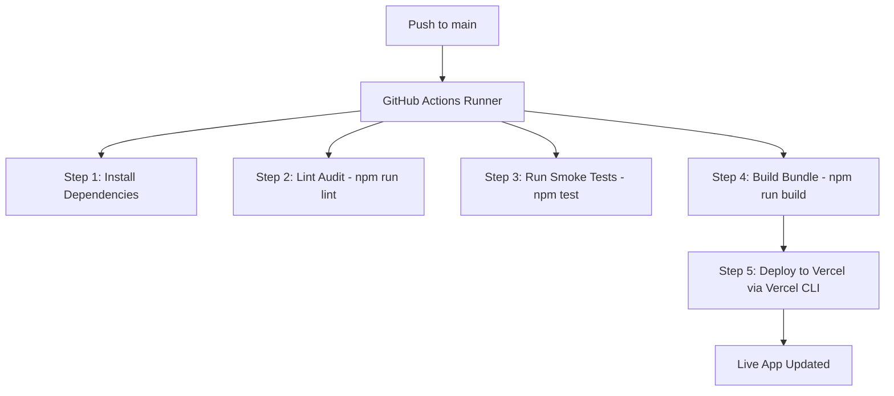

# PixelMind Recruit AI — Production-Ready SaaS Platform

PixelMind Recruit AI is an AI-powered recruitment and resume optimization platform designed to solve real business inefficiencies in hiring. Candidates use it to maximize their resume ATS compatibility, draft custom cover letters, and practice mock interviews. Recruiters use it to bulk-rank and filter candidates based on skills and resume criteria using Google Gemini.

Designed with a sleek, developer-focused aesthetic inspired by Vercel and Stripe, the app features glassmorphism, responsive visual charts, fluid animations, and robust TypeScript routing.

*   **Live Application URL**: [https://assessment-pixelmind-recruiter-ai.vercel.app](https://assessment-pixelmind-recruiter-ai.vercel.app)
*   **GitHub Repository**: [https://github.com/thejus07/Assessment-Pixelmind_recruiter_AI](https://github.com/thejus07/Assessment-Pixelmind_recruiter_AI)

---

## 💼 1. Business Value Proposition

The platform solves two core business problems in the hiring lifecycle:
1.  **For Candidates**: The "ATS Black Hole." Over 70% of resumes are filtered out by automated Applicant Tracking Systems before reaching human eyes. PixelMind uses Gemini AI to scan resumes, score formatting, highlight critical missing keywords, and suggest concrete formatting fixes, helping candidates secure interviews.
2.  **For Recruiters**: Sourcing Bottlenecks. Sifting through hundreds of applications manually takes hours. PixelMind's Recruiter Panel allows drop-uploading dozens of resumes in parallel, parsing them with AI, and rendering a sortable match grid that ranks candidates based on their technical fit, experience, and certifications.

---

## 🛠️ 2. Technology Stack

*   **Framework**: Next.js 16 (App Router) & React 19
*   **Language**: TypeScript (100% strict type safety)
*   **Styling**: TailwindCSS & Framer Motion (for animations and micro-interactions)
*   **AI Engine**: Google Gemini API (`gemini-2.5-flash`)
*   **Authentication**: Clerk Authentication (with Google OAuth and Email sign-ins)
*   **Database**: Supabase (PostgreSQL database with Row-Level Security)
*   **CI/CD & Hosting**: GitHub Actions & Vercel CLI

---

## 🔐 3. Database Schema & Security (RBAC)

The project supports a hybrid database model. If no database env keys are present, it falls back to an **Offline-First local storage architecture**. When Supabase keys are configured, it connects to these PostgreSQL tables:

### Profiles Table (`profiles`)
Tracks user roles and profiles synchronized from Clerk webhooks:
*   `id`: `text` (Primary Key - maps to Clerk User ID)
*   `name`: `text` (User's display name)
*   `email`: `text` (Unique email)
*   `role`: `text` (Defaults to `candidate`, supports `recruiter` and `admin`)
*   `avatar_url`: `text`

### Resumes Table (`resumes`)
*   `id`: `uuid` (Primary Key)
*   `user_id`: `text` (Foreign Key referencing `profiles.id`)
*   `file_name`: `text`
*   `file_url`: `text`
*   `ats_score`: `integer`
*   `analysis`: `jsonb` (Holds Gemini's structural audit, strengths, weaknesses, and skill gaps)

### Row-Level Security (RLS) Policies
Data is guarded directly in PostgreSQL:
*   **Candidates**: Can read and insert *only* their own resumes (`auth.uid() = user_id`).
*   **Recruiters**: Can select and read *all* candidate profiles and resume data to perform sorting and sourcing filters, but cannot edit them.

---

## 🔄 4. CI/CD Pipeline Architecture

The application implements a full-stage DevOps workflow inside [.github/workflows/deploy.yml](https://github.com/thejus07/Assessment-Pixelmind_recruiter_AI/blob/main/.github/workflows/deploy.yml) that triggers on every push to the `main` branch.



### GitHub Secrets Required:
*   `VERCEL_TOKEN`: Vercel Personal Access Token.
*   `VERCEL_ORG_ID`: Vercel Org/Team identifier.
*   `VERCEL_PROJECT_ID`: Vercel Project identifier.

---

## ⚡ 5. Setup & Local Installation

### Prerequisites
*   Node.js 18+ and npm

### 1. Offline Demo Mode (Out-of-the-Box)
The application has a built-in **Demo Mode fallback**. If no API keys are loaded, it will simulate Google Login, Chatbots, and Resume parsing locally in the browser cache without crashing.

### 2. Live API Mode
Create a `.env.local` file at the root:
```env
# Google Gemini API
NEXT_PUBLIC_GEMINI_API_KEY=your_gemini_api_key

# Clerk Auth Keys (without trailing $)
NEXT_PUBLIC_CLERK_PUBLISHABLE_KEY=pk_test_Y3VycmVudC1zdGFnLTgwLmNsZXJrLmFjY291bnRzLmRldiQ
CLERK_SECRET_KEY=sk_test_ODkgh9RNEn2nMtOfPMZXDD67ZCfaY4PqLbsNcXYs5e

# Supabase Keys (Optional)
NEXT_PUBLIC_SUPABASE_URL=https://your-project.supabase.co
NEXT_PUBLIC_SUPABASE_ANON_KEY=eyJhbGciOi...
```

### 3. Run Commands
```bash
# Install dependencies
npm install

# Run linter checks
npm run lint

# Run integration smoke tests
npm test

# Run local dev server
npm run dev
```
Open [http://localhost:3000](http://localhost:3000) to view the workspace.
